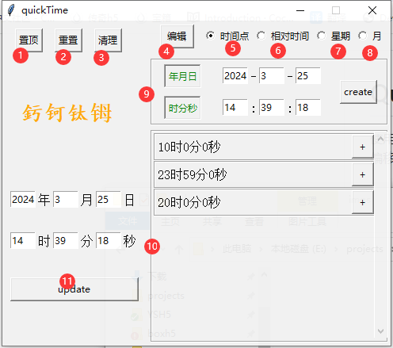
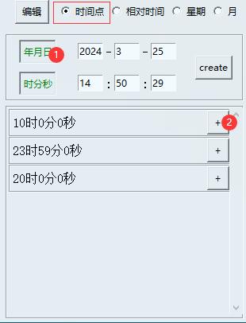
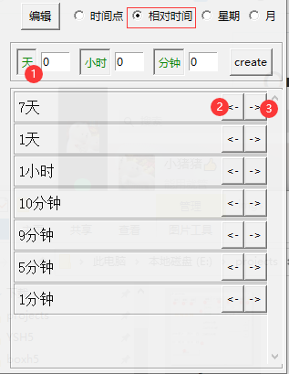
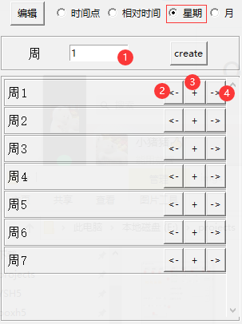
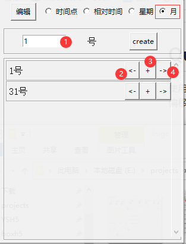
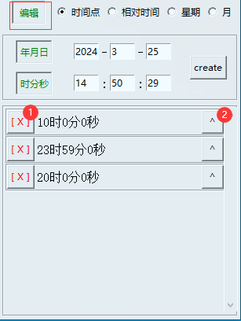

# QuickTime(釫钶钛𬭁)

使用python的tkinter库开发的快速修改本地时间点的GUI面板工具，可以根据用户的习惯设定多种不同对时间点（时间偏移）的预制，实现一键修改时间、时间还原等功能

注意事项：该工具因为要修改系统时间，所以需要管理员权限，为方便使用请 -右键-属性-兼容性-以用管理员权限运行

---

- ## 工具界面模块

   

- #### 1.置顶

   工具窗口的置顶功能，再次点击可以关闭置顶

- #### 2.重置

   重置时间到当前时间 _(该工具在关闭时，同样会触发一次时间重置)_

- #### 3.清理

   清理用户创建的所有的预制时间点,即<a href='#10'> 时间预制列表 </a>内的数据会被清空

- #### 4.编辑状态

   切换预制件的可操作状态

  - <a href='#200'>编辑状态</a>: 对已经预制好的时间点做 【调整顺序、删除】 操作
  - <a href='#100'>非编辑状态</a>: 使用提前预制的时间点

- #### 5.预制——绝对时间类型

   详情请见 <a href='#101'>绝对时间 </a>

- #### 6.预制——相对类型

   详情请见 <a href='#102'> 相对时间 </a>

- #### 7.预制——周x类型

   详情请见 <a href='#103'> 周x </a>

- #### 8.预制——x号类型

   详情请见 <a href='#104'> x号</a>

- #### 9.创建预制

   所有类型的时间类型都一定有该区域且包含create按钮，根据不同类型的设置的数据进行时间预制，点击create按钮可以对该时间点进行保存并创建一个预制体在<a href='10'> 时间预制列表</a> 中

- #### 10.时间预制列表<a id='10'>

   预制时间点列表，用户可以自定义时间点，并保存到该列表中，方便下次使用

   目前支持四种类型的时间类型，详情请见<a href='#100'> 时间点跳转功能 </a>

  - 固定时间点：跳转到指定的日期或时间 (yyyy-mm-dd [ hh:mm:ss ])
  - 相对时间：以当前时间为准，前移或后移指定的天、小时、分钟 (dd [ : hh [ : mm ]])
  - 周x：设置时间为本（上、下）周的周x
  - x号：设置时间为本（上、下）月的x号

- #### 11.修改时间

   设置本地时间为该区域的年月日时分秒的数值

----

- ## 时间点跳转类型<a id='100'>

   所有的create按钮点击后，会创建所有处于激活状态下的时间点预制

  - #### 固定时间点<a id='101'>

      

      1. 可选择 年月日、时分秒的激活状态
      2. 点击 + 按钮 设置时间为预制的时间点
         - 年月日：只修改年月日，时分秒不变
         - 时分秒：只修改时分秒，年月日不变
         - 年月日时分秒：同时修改年月日时分秒

  - #### 相对时间<a id='102'>

      

      1. 可设置天、小时、分钟的激活状态
      2. 点击 <- 按钮 时间向前移动指定时间<a id='110'>
         - n天 [ n小时 [ n分钟 ] ]：时间移动n天[ n小时 [ n分钟 ] ]
      3. 点击 -> 按钮 逻辑相似于<a href='#110'> <- 按钮 </a>，时间相反偏移

  - #### 周x <a id='103'>

      

      1. 可设置为一周的周几
      2. 点击 + 按钮 设置为本周的周x
      3. 点击 <- 按钮 设置为上周的周x
      3. 点击 -> 按钮 设置为下周的周x

  - #### x号<a id='104'>

      

      1. 可设置一月的x号  _(注：如果该月天数不足设置的x号，则会自动设置为该月的最后一天)_
      2. <- , + , -> 按钮逻辑相似于 <a href='#103'> 周x </a> 的对应按钮

----

- ## 编辑状态<a id='200'>

   编辑状态下的操作是处理的预制时间点列表中的数据，而非时间点跳转功能

   

   1. 删除按钮：删除当前选中的预制体和数据
   2. 向上移动按钮：将当前选中的预制体向上移一位

----

github: https://a6166231@github.com